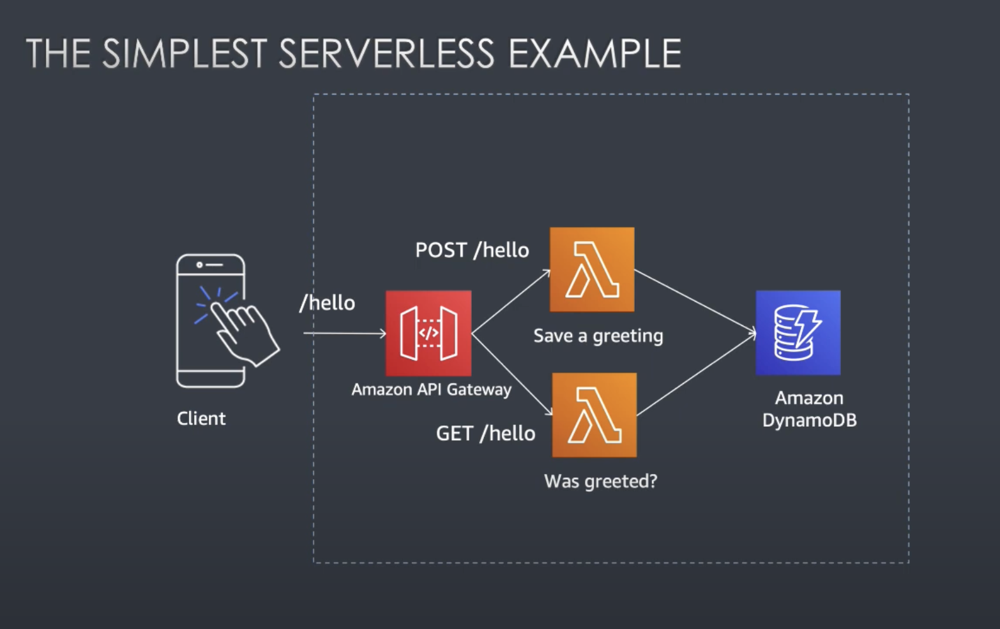

# CDK Example Project using Lambda, API Gateway and DynamoDB

This is a simple example project to demonstrate the use of the AWS Cloud Development Kit (CDK)
to create a simple aws-lambda function and an API Gateway to trigger it.

## Useful paths

| Method | Path       | Body         | Func Name | Description       |
|--------|------------|--------------|-----------|-------------------|
| GET    | /store/:id |              | find      | Search item by id |
| GET    | /stores    |              | list      | Search all items  |
| POST   | /store     | {name: Lima} | save      | Create one item   |
| DELETE | /store     | {name: Lima} | delete    | Remove one item   |

> Default CDK project README.md

## Welcome to your CDK TypeScript project

This is a blank project for CDK development with TypeScript.

The `cdk.json` file tells the CDK Toolkit how to execute your app.

### Useful commands

* `npm run build`   compile typescript to js
* `npm run watch`   watch for changes and compile
* `npm run test`    perform the jest unit tests
* `npx cdk deploy`  deploy this stack to your default AWS account/region
* `npx cdk diff`    compare deployed stack with current state
* `npx cdk synth`   emits the synthesized CloudFormation template

